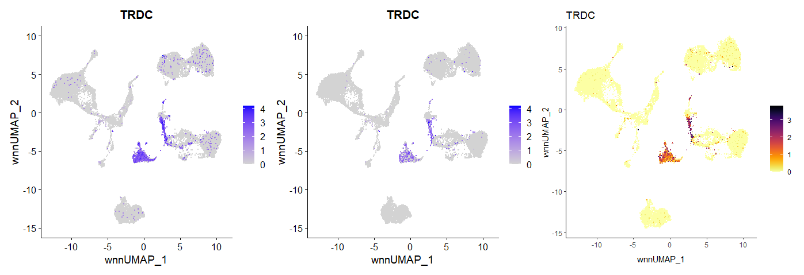

# Hex Plots for Single Cell Expression Data

Simple functions to create ggplot2 plots to visualize single cell expression data in 2D dimensionality reductions to avoid overplotting. Inspired by the [ggHex](https://www.rdocumentation.org/packages/ArchR/versions/1.0.1/topics/ggHex) function in [ArchR](https://www.archrproject.com/). Includes a wrapper for Seurat objects that is almost a drop-in replacement for FeaturePlot (for single features only for now). Mainly created for convenience and personal use, but feel free to use it if you find it useful.

## Motivation

When plotting gene expression in a 2D plot, overplotting can be a problem, especially for data sets with many cells. The default Seurat FeaturePlot has the option of ordering the cells by expression, but this can lead to overestimating the number of cells with high expression, when `order = TRUE` or underestimating when `order = FALSE`. The [ggHex](https://www.rdocumentation.org/packages/ArchR/versions/1.0.1/topics/ggHex) function in [ArchR](https://www.archrproject.com/) is a nice alternative, as it plots hexagonal bins which are colored by the mean expression of the cells in their area. However, ggHex is not a drop-in replacement for FeaturePlot and loading ArchR for this one function is a bit overkill. This package provides a simple function to create hex plots based on ggplot2 for single cell expression 
data, which can be used as a drop-in replacement for FeaturePlot.

In the figure below you can see a comparison of the default FeaturePlot and the hex plot for the same data. From left to right: FeaturePlot with `order = TRUE`, FeaturePlot with `order = FALSE`, hex plot.



## Installation

```r
# install.packages("remotes")
remotes::install_github("derpylz/hexpression")
```

## Usage

```r
library(hexpression)
library(Seurat)
# Load example data
library(SeuratData)
InstallData("bmcite")
bm <- LoadData("bmcite")
# Run dimensionality reduction
bm <- RunUMAP(bm, nn.name = "weighted.nn", reduction.name = "wnn.umap", reduction.key = "wnnUMAP_", return.model = TRUE)
# Plot expression of TRDC
HexPlot(bm, "TRDC", bins = 200, reduction = "wnn.umap")
```

## License

Apache License 2.0

## Similar packages

- [hexbin](https://cran.r-project.org/web/packages/hexbin/index.html)
